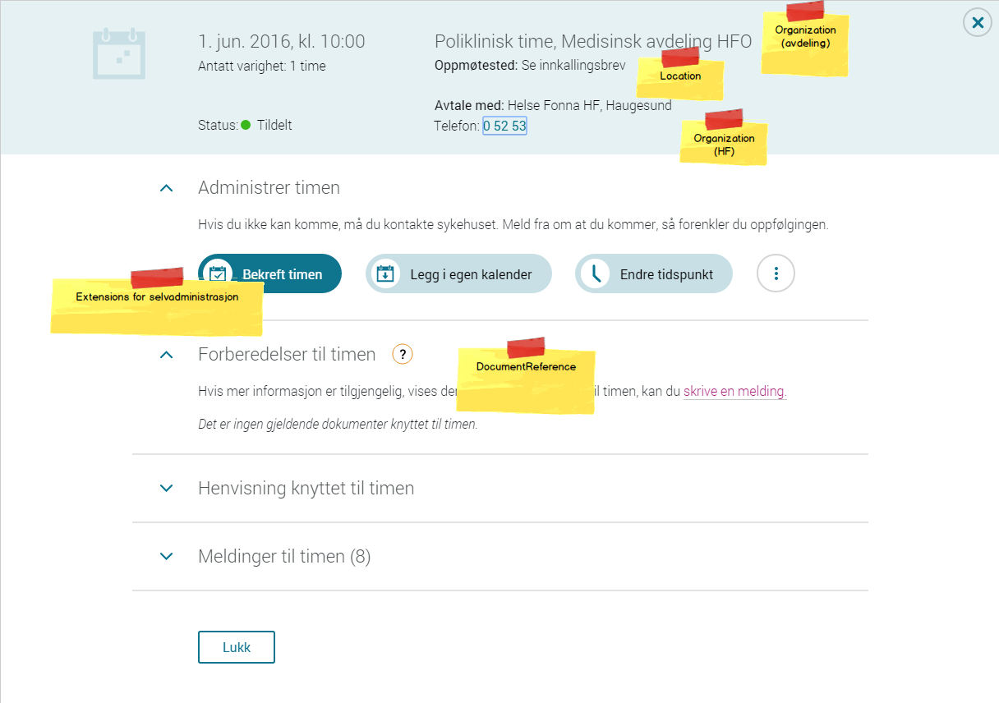

===========================================
FHIR for utveksling av informasjon om timer
===========================================

Bakgrunn
========

Helsenorge har ønske om en rikere PULL-tjeneste for timer, og ønsker å benytte FHIR for dette.

Dette dokumentet er innspill rundt bruk av FHIR-ressurser.

Om FHIR
=======

FHIR-standarden har flere deler:

* Ressurstyper, inkludert sammenhenger mellom ressurser.
* Spesifikasjon av et REST-grensesnitt.

Dagens løsning
==============

I dag gjør helsenorge en HL7v3 PRSC_IN010701NO-spørring mot et endepunkt hos RHFet. Systemet gjør en slik spørring når brukeren går inn på siden for timeavtaler på helsenorge. Spørringen gjøres med SOAP over HTTP.

Helsenorge bruker resultatet fra spørringen for å vise innbyggerens timer i portalen.

Sammen med informasjon om timen viser portalen to typer informasjon som ligger lagret i personlig helsearkiv (PHA):

 * Innkallingsbrev knyttet til timen
 * Dialog knyttet til timen

Se også:

 * http://www.hl7.no/hl7wiki/index.php?title=Implementasjonsguide_HL7
 * http://hl7.ihelse.net/Dokument/HL7v3_ImplementationGuide_3.0d.doc
 * http://www.nasjonalikt.no/filestore/Dokumenter/Prosjekter_og_tiltak/Sluttrapporter/Vedl05b2011-09-28KITH1038-2011HL7v3_ImplementationGuide_v40.pdf

Det funksjonelle behovet på helsenorge
======================================

   Time-molekylet på helsenorge.no

   For en time viser systemet:

    * Oppmøtetidspunkt og varighet
    * Status ("Tildelt")
    * Type time ("Poliklinisk time") -
    * Avdeling ("Medisinsk avdeling HFO")
    * Oppmøtested ("Se innkallingsbrev")
    * Oppmøtested ("Se innkallingsbrev")

Generell FHIR-server eller kun for timer?
=========================================

En kan tenke seg to alternativer for hvordan server-siden utvikles:

 * Alternativ 1: En generell FHIR-tjeneste som tar i mot spørringer etter FHIR-standarden og returnerer en FHIR Bundle som spesifisert i spørringen.
 * Alternativ 2: En tjeneste som tar inn innbyggers personnummer (og evt andre parametre vi trenger for å dekke det funksjonelle behovet) og returnerer en nærmere spesifisert FHIR Bundle.

Dette valget vil påvirke både hvem som kan lage tjenesten og hvilket omfang det vil være å utvikle en slik tjeneste.

.. list-table::
   :header-rows: 1

   * - Alternativ
     - Hvem kan lage?
     - Omfang
   * - Generell FHIR-tjeneste
     - EPJ-leverandør
     - Stort
   * - Spesifikk for timer
     - RHF integrasjonsplattform

       EPJ-leverandør
     - Mindre

Noen ting det kan være nyttig å tenke på
========================================

* Det funksjonelle behovet kan være svært forskjellig fra en integrasjon til en annen
* Derfor kan det være vanskelig å få til en generell FHIR-server som kan dekke alle behov

Div notater
===========

mol_molekyl_timeavtale: appointment-details-component.jsx

"Antatt varighet" dersom

Type time bestemmes ut fra appointment.CareLevel:
    Amb(0)|Rtg(4)"infoHeaderPolyclinicAppointment": "Poliklinisk time",
    Ss(1): "infoHeaderPolyclinicTreatment": "Poliklinisk behandling",
    Imph(3): "infoHeaderHospitalization": "Innleggelse",
    Alle andre: "infoHeaderTreatment": "Behandling",

appointment.CareLevel
